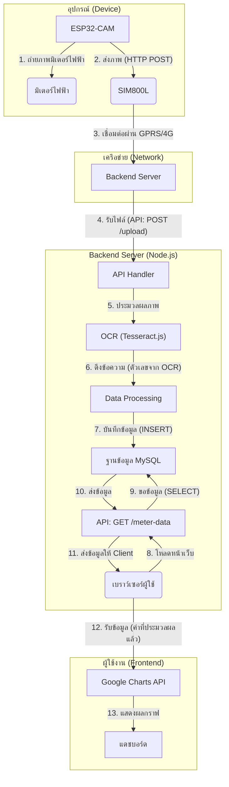

```mermaid
graph TD
    subgraph "อุปกรณ์ (Device)"
        direction LR
        A[ESP32-CAM] -- "1. ถ่ายภาพมิเตอร์ไฟฟ้า" --> B(มิเตอร์ไฟฟ้า)
        A -- "2. ส่งภาพ (HTTP POST)" --> C(SIM800L)
    end

    subgraph "เครือข่าย (Network)"
        C -- "3. เชื่อมต่อผ่าน GPRS/4G" --> D[Backend Server]
    end

    subgraph "Backend Server (Node.js)"
        direction TB
        D -- "4. รับไฟล์ (API: POST /upload)" --> E[API Handler]
        E -- "5. ประมวลผลภาพ" --> F["OCR (Tesseract.js)"]
        F -- "6. ดึงข้อความ (ตัวเลขจาก OCR)" --> G[Data Processing]
        G -- "7. บันทึกข้อมูล (INSERT)" --> H[ฐานข้อมูล MySQL]
        
        I["API: GET /meter-data"] -- "9. ขอข้อมูล (SELECT)" --> H
        H -- "10. ส่งข้อมูล" --> I
        I -- "11. ส่งข้อมูลให้ Client" --> J
    end

    subgraph "ผู้ใช้งาน (Frontend)"
        direction TB
        J(เบราว์เซอร์ผู้ใช้) -- "8. โหลดหน้าเว็บ" --> I
        J -- "12. รับข้อมูล (ค่าที่ประมวลผลแล้ว)" --> K[Google Charts API]
        K -- "13. แสดงผลกราฟ" --> L[แดชบอร์ด]
    end

```